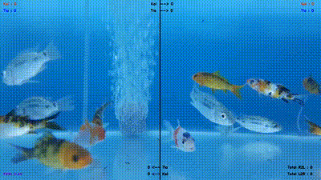

# Automated Marine Animal Identification and Detection of Species


**Mission:** Empower fishermen through cutting-edge technology by revolutionizing the fishing industry with a sustainable and efficient approach.

## Project Overview

The **INCOIS_AAIDeS Project** leverages advanced deep learning techniques to analyze fish behavior directly from the net. This innovative system aims to:

- Optimize fishing efficiency.
- Promote sustainability in marine ecosystems.
- Provide actionable insights to fishermen for better decision-making.

  

## Features

- **Deep Learning Model:** Analyzes fish species and behaviors using real-time data.
- **Automation:** Reduces manual labor and errors in fish identification.
- **Sustainability:** Ensures responsible fishing practices by monitoring fish populations.

## File Structure

### `fish.py`

This is the core script for the **AAIDeS** project. It includes:

- **Model Implementation:** Deep learning algorithms for detecting and identifying fish species.
- **Data Processing:** Functions for preprocessing inputs (images/videos).
- **Prediction Pipeline:** Generates insights based on netted fish behavior.

## Prerequisites

- **Programming Language:** Python 3.7+
- **Libraries:**
  - TensorFlow
  - OpenCV
  - NumPy
  - Matplotlib
  - Pandas

## Installation

1. Clone the repository:
   ```bash
   git clone https://github.com/your-repo/INCOIS_AAIDeS.git
   ```
2. Navigate to the project directory:
   ```bash
   cd INCOIS_AAIDeS
   ```
3. Install dependencies:
   ```bash
   pip install -r requirements.txt
   ```

## Usage

1. Run the script to process sample data:
   ```bash
   python fish.py
   ```
2. Upload fish images or videos to analyze their behavior and species.

## Contributing

We welcome contributions to enhance the AAIDeS project. Please follow these steps:

1. Fork the repository.
2. Create a new branch (`feature/your-feature-name`).
3. Commit your changes.
4. Submit a pull request.

---

### 🚀 Maintained by [Sanjay A R](https://github.com/sanjay-ar)

[](https://portfolio-ar.vercel.app/)  
[](https://www.linkedin.com/in/sanjay-ar/)  
[](https://github.com/sanjay-ar)

> 💡 *Like this project? Leave a ⭐ and connect with me!*

